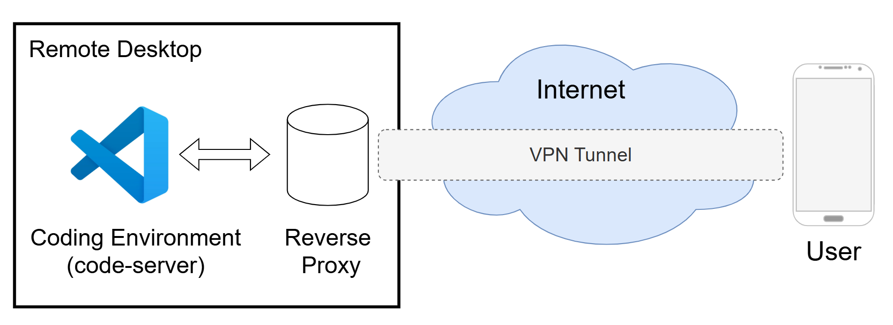
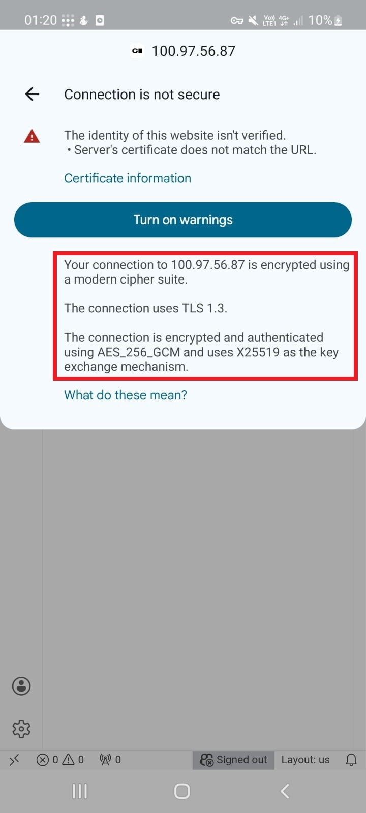

# Remote Coding from Android via WSL + code-server

Full setup to securely code on your Windows 10 Home machine from an Android phone.

---

## Architecture Overview

<p align="center">
  
</p>

<p align="center">
  <em>Secure connection flow: code-server runs locally, accessed through a reverse proxy over an encrypted VPN tunnel.</em>
</p>

---

## 1. Prerequisites

- Windows 10 with WSL2 installed (Ubuntu recommended)
- Android phone
- Tailscale account (for secure private network)
- GitHub account (for OAuth authentication)
- Administrative access on WSL

---

## 2. Install Tailscale

### On Windows

Download and install Tailscale: https://tailscale.com/download

Sign in with your account.

### On WSL (optional)
```bash
sudo snap install tailscale
sudo tailscale up
```

### On Android

Install Tailscale from Play Store.

Sign in with the same account.

Make sure your phone and WSL machine can ping each other's Tailscale IP:
```bash
ping <WSL-Tailscale-IP>
```

---

## 3. Install code-server in WSL
```bash
# Update packages
sudo apt update && sudo apt upgrade -y

# Install code-server
curl -fsSL https://code-server.dev/install.sh | sh

# Run code-server (bind to localhost)
code-server --bind-addr 127.0.0.1:8080
```

Test locally:
```bash
curl http://127.0.0.1:8080
```

You should see `HTTP server listening on http://127.0.0.1:8080/`

> **Note:** code-server does not serve HTTPS directly. Nginx will handle HTTPS.

---

## 4. Install OAuth2 Proxy

### Download binary
```bash
curl -L -o /usr/local/bin/oauth2-proxy https://github.com/oauth2-proxy/oauth2-proxy/releases/latest/download/oauth2-proxy-linux-amd64
sudo chmod +x /usr/local/bin/oauth2-proxy
```

### Create config file
```bash
sudo nano /etc/oauth2-proxy.cfg
```

Do not fill in client ID or secret yet. We will generate them in the next step.

---

## 5. Create GitHub OAuth App

To allow OAuth2 Proxy to authenticate users, create a GitHub OAuth App:

### Step 1: Register the App

1. Go to [GitHub Developer Settings](https://github.com/settings/developers) and click **New OAuth App**.
2. Fill in the form:
   - **Application name:** code-server (or any name you prefer)
   - **Homepage URL:** `https://<TAILSCALE-IP>/`
   - **Authorization callback URL:** `https://<TAILSCALE-IP>/oauth2/callback`
3. Click **Register application**.

### Step 2: Get the Client ID and Secret

After registering the app, GitHub provides:

- **Client ID** → paste into `oauth2-proxy.cfg`
- **Client Secret** → paste into `oauth2-proxy.cfg`

### Step 3: Generate a Cookie Secret

OAuth2 Proxy also requires a 32-byte secret for cookies:
```bash
head -c 32 /dev/urandom | base64 | tr -d '\n'
```

### Step 4: Update OAuth2 Proxy Configuration

In `/etc/oauth2-proxy.cfg`, replace placeholders:
```ini
provider = "github"
client_id = "YOUR_GITHUB_CLIENT_ID"
client_secret = "YOUR_GITHUB_CLIENT_SECRET"

http_address = "127.0.0.1:4180"
cookie_secret = "YOUR_GENERATED_COOKIE_SECRET"

upstreams = [ "http://127.0.0.1:8080" ]
redirect_url = "https://<TAILSCALE-IP>/oauth2/callback"
email_domains = [ "*" ]
reverse_proxy = true
skip_provider_button = true
cookie_secure = true
cookie_expire = "8h"
cookie_refresh = "1h"
```

**Notes:**

- `redirect_url` must exactly match the callback URL.
- `email_domains = ["*"]` allows all GitHub users. Restrict if needed.
- Keep `client_secret` and `cookie_secret` secure; do not expose them publicly.

### Step 5: Run OAuth2 Proxy
```bash
sudo oauth2-proxy --config /etc/oauth2-proxy.cfg
```

Test:
```bash
curl http://127.0.0.1:4180
```

Should return HTML of GitHub login page.

---

## 6. Install and configure Nginx
```bash
sudo apt install nginx -y
```

### Create Nginx site
```bash
sudo nano /etc/nginx/sites-available/code-server
```

Example configuration:
```nginx
server {
    listen 443 ssl;
    server_name <TAILSCALE-IP>;  # Tailscale IP of your WSL

    ssl_certificate     /etc/ssl/localca/server.crt;
    ssl_certificate_key /etc/ssl/localca/server.key;

    ssl_protocols       TLSv1.2 TLSv1.3;
    ssl_ciphers         HIGH:!aNULL:!MD5;

    location / {
        proxy_pass http://127.0.0.1:4180;  # OAuth2 Proxy
        proxy_set_header Host $host;
        proxy_set_header X-Forwarded-Proto https;
        proxy_set_header X-Forwarded-For $remote_addr;
        proxy_set_header X-Real-IP $remote_addr;

        # WebSocket support
        proxy_http_version 1.1;
        proxy_set_header Upgrade $http_upgrade;
        proxy_set_header Connection "upgrade";
        proxy_read_timeout 86400s;
    }
}
```

### Enable site
```bash
sudo ln -s /etc/nginx/sites-available/code-server /etc/nginx/sites-enabled/
sudo nginx -t
sudo systemctl reload nginx
```

---

## 7. Create self-signed SSL certificates (for local HTTPS)
```bash
sudo mkdir -p /etc/ssl/localca
cd /etc/ssl/localca

# Create local CA
# Replace XX with your 2-letter country code (e.g., US, DE, GB)
sudo openssl genrsa -out ca.key 2048
sudo openssl req -x509 -new -nodes -key ca.key -days 3650 -out ca.crt -subj "/C=XX/O=YourName/CN=LocalCA"

# Create server key and CSR
sudo openssl genrsa -out server.key 2048
sudo openssl req -new -key server.key -out server.csr -subj "/C=XX/O=YourName/CN=<TAILSCALE-IP>"

# Sign server cert with local CA
sudo openssl x509 -req -in server.csr -CA ca.crt -CAkey ca.key -CAcreateserial -out server.crt -days 825 -sha256
```

Use `/etc/ssl/localca/server.crt` and `server.key` in Nginx config.

> **Note:** Browsers will show a security warning when you first connect. This is normal for self-signed certificates. Install the CA certificate on your Android device to trust it.

---

## 8. Install the CA Certificate on Android

1. Transfer `ca.crt` to your Android device.
2. Go to Settings > Security > More security settings > Install from device storage (path may vary).
3. Select the `ca.crt` file.
4. Give it a name and confirm installation.

After installation, your browser will trust the certificate, and HTTPS encryption will be fully active.

---

## 9. Start all services

### Step 1: code-server
```bash
code-server --bind-addr 127.0.0.1:8080
```

### Step 2: OAuth2 Proxy
```bash
sudo oauth2-proxy --config /etc/oauth2-proxy.cfg
```

### Step 3: Nginx
```bash
sudo systemctl restart nginx
```

---

## 10. Connect from Android

1. Make sure Tailscale is active on your phone.
2. Open a browser and go to:
```
https://<TAILSCALE-IP>/
```

3. Log in via GitHub (OAuth2 Proxy).
4. After login, you will see the code-server IDE.

### Result

Once connected, you will have full access to your WSL instance running on your Windows machine directly from your Android phone:

<table>
  <tr>
    <td></td>
    <td></td>
  </tr>
  <tr>
    <td><em>Full root access to the WSL instance from an Android phone via code-server.</em></td>
    <td><em>Connection secured with TLS 1.3 and AES-256-GCM encryption over HTTPS.</em></td>
  </tr>
</table>

---

## 11. Security Overview

This setup ensures secure access through multiple layers:

- **Tailscale VPN:** Encrypted private network prevents exposure to the internet.
- **HTTPS via Nginx:** Encrypts credentials, cookies, and data in transit.
- **OAuth2 Authentication:** GitHub login and optional two-factor authentication enforce authorized access.
- **Secure Cookies:** HTTP-only and secure flags prevent interception and XSS attacks.
- **Local-only Backend:** code-server is bound to localhost, forcing access through Nginx and OAuth2 Proxy.
- **Self-signed Certificates:** Ensures encryption without a public CA.
- **Restricted Exposure:** No services are publicly accessible; both VPN and OAuth2 are required.

---

## 12. Optional Enhancements

- Create systemd services for auto-start.
- Use a domain name instead of Tailscale IP.
- Secure `cookie_secret`:
```bash
sudo chmod 600 /etc/oauth2-proxy.cfg
```

- Enable HTTP to HTTPS redirect in Nginx:
```nginx
server {
    listen 80;
    server_name <TAILSCALE-IP>;
    return 301 https://$host$request_uri;
}
```